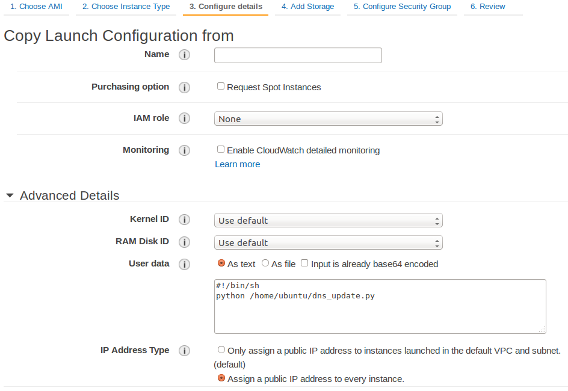

## Assign Elastic IP script ##
Simple Python script to assign Elastic IP to your instance

## Requirements ##
- python installer (pip)

  ```cd /tmp && wget https://bootstrap.pypa.io/get-pip.py && python get-pip.py```

- AWS Python SDK (boto)

  ```pip install boto```
  

### Usage ###
Modify aws_config_example.py with your AWS details.
```
access_key = '<AWS access key>'
secret_key = '<AWS secret key>'
eip_id = '<Elastic IP ID>'
region = '<AWS region>'
```

Execute.

```python aws_assign_eip.py```

### Cloud-init integration with AWS ###
Place the script in /home/ubuntu and create AMI. In launch configuration, in step 3, add below.

```
#!/bin/sh
python /home/ubuntu/aws_assign_eip.py
```




### To do ###
Provide IAM policy required to run it.